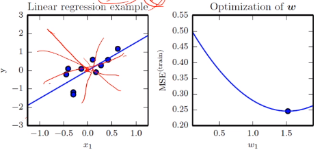

# [Week8 - Day3] Deep Learning 2 데이터

## 1. 데이터에 대한 이해
  - 과학 기술의 정립 과정
    - 데이터 수집 -> 모델 정립 -> 예측 -> 새로운 데이터 수집
  - 기계학습
    - 복잡한 문제/과업을 다룸
      - 지능적 범주의 행위들은 규칙의 다양한 변화 양상
    - 단순한 수학 공식으로 표현 X
    - 데이터를 설명할 수 있는 학습 모델을 찾아내는 과정

### 1-1 데이터 생성 과정
  - 데이터 생성 과정을 완전히 아는 경우
    - *x*를 알면 *y*를 정확히 예측 가능
    - *x* 의 발생 확률 *P*(*x*)를 정확히 계산 가능
    - *P*(*x*)를 통해 새로운 데이터 생성 가능
  - 실제 기계 학습 문제 (현실)
    - 데이터 생성 과정을 알 수 없음
    - 주어진 Training Set *X*, *Y*에 가설 모델을 통해 <u>근사 추정</u>**만** 가능

### 1-2 데이터의 중요성
  - 데이터의 양과 질
    - 주어진 과업에 적합한 데이터를 충분히 수집 -> 성능 향상
    - 문제에 관련된 데이터 확보는 매우 중요

### 1-3 DB 크기와 기계 학습 성능
  - 데이터 양 ↓ -> 차원의 저주와 관련
  - 적은 데이터로 높은 성능을 달성하는 이유
    - 데이터 희소 특성 가정
      - 방대한 공간에서 실제 데이터가 발생하는 곳은 매우 작은 부분 공간
    - 매니폴드 가정
      - 고차원의 데이터는 관련된 낮은 차원의 매니폴드에 가깝게 집중
      - 일정한 규칙에 따라 매끄럽게 변화

### 1-4 데이터 가시화
  - 4차원 이상의 초공간(Hyperplane)은 한번에 시각화 불가능
  - 여러가지 시각화 방법
    - 2개씩 조합하여 시각화
    - 저차원의 데이터로 변환하여 시각화

### 2. 기계학습의 예
  - 선형회귀 문제
    - 직선 모델의 2개의 파라미터 \theta = (*w*, *b*)*T*
  - 목적함수 (비용함수)
    - 선형 회귀를 위한 목적 함수
      - MSE (평균 제곱 오차) : E = \Sigma (*f*\theta(*x**i*) - *y**i*)
  - 최초에는 최적 파라미터 값을 알 수 없으므로 임의의 난수로 파라미터를 설정
  - 선형 회귀문제와 파라미터 최적화의 관계
    - 
  - 최적화 이론
    - convex
    - non-convex
  - 작은 개선을 반복하여 최적의 해를 찾아가는 수치적 방법으로 계산
  - 실제 세계는 선형이 아니며 노이즈가 섞임 -> 비선형 모델이 필요