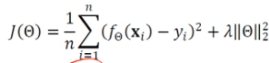

# [Week8 - Day3] Deep Learning 3

## 1. 기계학습 요소
  - 카드 승인 예제
    - 요소
      - input, output, target distribution, data, hypothesis
    - 설정
      - 지도 학습
        - 데이터, 목적함수, 가설의 최적화로 구분 가능
        - 데이터를 받아 계산을 하고 목적함수를 통해 가설을 최적화

## 2. 모델 선택
### 2-1 Underfitting - Overfitting (과소적합-과잉적합)
  - Underfitting
    - 모델의 용량이 작아서(구조가 너무 단순해서) 데이터에 내재된 규칙을 따라가지 못하는 경우
  - Overfitting
    - Training Set에 대해 완벽하게 근사화함
    - 새로운 데이터를 예측할 때 문제 발생
    - 모델의 용량이 커서 학습과정에서 노이즈까지 수용하여 학습
    - 적절한 용량의 모델을 선택하는 작업이 필요
  - 규제를 통해 모델의 용량이 커지는 것을 억제

### 2-2 편향(Bias)과 분산(Variance)
  - 용량이 작음 -> 편향 ↑, 분산 ↓
  - 용량이 큼 -> 편향 ↓, 분산 ↑ -> Overfitting 확률 ↑
  - 편향과 분산은 상충 관계
  - 기계학습의 목표
    - 낮은 편향과 낮은 분산을 가진 예측 모델을 만드는 것
    - 그러나 편향 <-> 분산 상충 관계
    - 편향을 최소로 유지하면서 분산을 최대로 낮추는 전략 필요

### 2-3 검증 집합과 교차검증을 이용한 모델 선택
  - 검증 집합을 이용한 모델 선택
    - 일반적으로는 테스트 데이터가 존재하지 않으므로 Train Set에서 일부를 Valid Set으로 분리
    - 일반화 성능 측정 가능
  - 교차 검증
    - 비용 문제로 별도의 검증 집합이 없는 상황에 유용한 모델 선택법
    - 훈련 집합을 등분하여 학습과 평가 과정을 여러번 반복후 평균을 사용
    - 10-fold Cross Validation
  - 부트스트랩 (Bootstrap)
    - 임의의 복원 추출 샘플링을 반복
      - 데이터 분포가 불균형일 때 적용

### 2-4 모델 선택의 한계와 현실적인 해결책
  - 다양한 학습 모델
    - Neural Network
    - Support Vector Machine (SVM)
    - Decision Tree
  - 경험을 통해 가설을 선택
    - 이후 모델 선택 알고리즘을 통해 세부 모델을 결정
  - 현대의 전략
    - 용량이 충분히 큰 모델을 선택
    - 선택한 모델이 정상을 벗어나지 않도록 규제를 적용

## 3. 규제 (정규화, Generalization)
### 3-1 데이터 확대
  - 데이터를 더 많이 수집하면 일반화 능력이 향상
    - 많은 비용이 필요, 실측 자료에 대한 라벨링을 직접 해야함
  - Data Augmentation
    - Train Set의 데이터를 변형하여 사용
    - 원 데이터의 속성이 변하지 않도록 유의

### 3-2 가중치 감쇠
  - 가중치를 작게 조절하는 기법
  - 개선된 목적함수를 이용하여 가중치를 작게 조절하는 규제 기법
    - 
    - L2 Generalization을 적용하여 가중치 크기를 작게 유지
    - \lambda는 주어진 가중치의 감쇠 선호 정도를 제어
      - \lambda = 0 : 감쇠 X
      - \lambda 값이 클 수록 가중치가 더 작아짐

## 4. 기계학습 유형
### 4-1 지도 방식
  - Supervised Learning (지도 학습)
    - 특징 벡터 **X**와 목표치 **Y**가 모두 존재
    - 회귀, 분류 문제
  - Un-Supervised Learning (비지도 학습)
    - 특징 벡터 **X**는 존재하지만 목표치 **Y**가 없는 경우
    - 군집화(Clustering), 밀도추정, 특징 공간 변환 문제
  - Reinforcement Learning (강화 학습)
    - 지도학습과 다른 형태의 목표치(보상)을 기준으로 진행
    - 게임을 구성하는 샘플들 각각에 Reward를 나누어 줘야 함
  - Semi-Supervised Learning (준지도 학습)
    - 일부는 **X**, **Y**가 모두 존재하지만 나머지는 **Y**가 없는 경우
    - 대부분의 데이터가 **X**의 수집은 쉽지만 **Y**는 수작업이 필요하므로 최근에 중요성이 부각됨

### 4-2 다양한 기준
  - 오프라인 - 온라인
    - 일반적으로 오프라인 학습
    - 온라인 : IoT 등에서 추가로 발생하는 데이터 샘플을 가지고 점증적 학습 수행
  - 결정론적 - 확률적 (빈도주의 - 베이지안)
    - 결정론적 : 같은 데이터를 통해 다시 학습하면 같은 예측 모델이 생성
    - 확률적 : 학습 과정에서 확률 분포를 사용하므로 동일한 데이터를 사용해도 다른 모델이 생성
  - 분별 - 생성 모델
    - 분별 모델 : 부류 예측에만 관심 -> *P*(*y*|**x**)의 추정에만 집중
    - 생성 모델 : *P*(**x**), *P*(**x**|*y*) 를 추정
      - 새로운 샘플 생성 가능