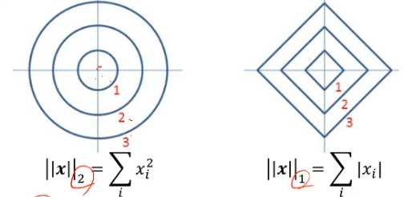
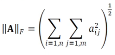

# [Week8 - Day3] Deep Learning 4

## 1. 미리보기
  - 머신 러닝에서 수학의 역할
    - 수학은 비용함수를 정의, 최저점을 찾아주는 최적화 이론 제공
    - 최적화 이론에 학습률, 중단 조건과 같은 제어를 추가하여 알고리즘 구축
    - 사람은 알고리즘을 설계, 데이터를 수집

## 2. 선형대수
  - 머신 러닝을 위한 기본 선형대수

### 2-1 벡터와 행렬
#### 2-1-1 벡터
  - 요소의 종류와 크기 표현
  - 데이터 집합의 여러 개 특징 벡터를 첨자로 구분 (**x***i*)
  - 샘플을 특징 벡터로 표현

#### 2-1-2 행렬
  - 여러 개의 벡터를 표현
  - 요소 : **x**ij
    - i행 : **x**i,:
    - j열 : **x**:,j
  - 설계 행렬 : Train Set을 담은 행렬
  - 전치 행렬 (Transpose)
    - (**A***T*i,j) = **A**j,i
    - (**AB**)T = **B**T**A**T
  - 행렬을 통해 방정식(방정식계)를 간결하게 표현 가능
  - 특수 행렬
    - 정방행렬
    - 대각행렬
    - 단위행렬
    - 대칭행렬
  - 행렬 연산
    - 행렬 곱 (Dot Product)
      - **C** = **AB**
      - 교환 법칙 성립 X -> **AB** =/= **BA**
      - 분배 법칙 성립 -> **A**(**B**+**C**) = **AB**+**AC**
      - 결합 법칙 성립 -> **A**(**BC**) = (**AB**)**C**
      - q벡터의 변환
    - 벡터 내적 (Inner Product)

#### 2-1-3 텐서
  - 3차원 이상의 구조를 가지는 숫자 배열

### 2-2 놈과 유사도
  - 유사도와 거리
    - 벡터를 기하학적으로 해석
    - 코사인 유사도
  - 놈 (Norm)
    - 벡터와 행렬의 거리를 놈으로 측정
    - 벡터의 p차 놈 ||**x**||p = (\Sigma(|*x**i*|*p*))1/*p*
      - 1차 놈 : Manhattan distance 
      - 2차 놈 : Euclidean distance
      - 
      - 경사 하강법 규제에 사용
    - 프로베니우스 놈
      - 행렬의 크기를 측정
      - 

### 2-3 퍼셉트론의 해석
  - 퍼셉트론 (Perceptron)
    - 1958년 고안된 분류기 모델
    - *o* = \tau(**w**, **x**)
      - 활성 함수 \tau는 계단 함수
  - 퍼셉트론의 물리적 의미
    - 퍼셉트론의 직선은 두개의 공간 부분을 나누는 결정 직선
    - 3차원 특징공간에서는 결정 평면, 4차원 이상에서는 결정 초평면으로 표현
  - 여러개의 퍼셉트론 출력 표현
    - **o** = \tau(**Wx**)
    - 가중치 벡터를 각 부류의 기준 벡터로 간주시 c개 부류의 유사도 계산과 유사
  - 학습의 정의
    - 추론 : 학습을 마친 알고리즘을 현장의 새로운 데이터에 적용
    - 훈련 : Train Set의 샘플에 대해 가장 잘 만족하는 **W**를 탐색
    - 현대 머신러닝에서 딥러닝은 퍼셉트론을 여러층으로 확장

### 2-4 선형결합과 벡터공간
  - 벡터
    - 공간상의 한 점으로 화살표 끝이 벡터의 좌표
  - 선형결합이 만드는 벡터공간
    - 기저벡터 **x**, **y**의 선형 결합
      - **b** = *a*1**x** + *a*2**y**
    - 벡터 공간 : 선형결합으로 만들어지는 공간

### 2-5 역행렬
  - 정사각 행렬 **A** 의 역행렬 **A**-1
    - **A**-1**A** = **AA**-1 = **I**
  - 역행렬을 활용한 방정식 표현과 해
    - 방정식 **Ax** = **b**
      - **A** : 알고 있는 행렬
      - **b** : 알고 있는 벡터
      - **x** : 탐색하려는 벡터
    - 선형 방정식인 경우
      - 불능 : 해 없음
      - 부정 : 다수의 해 존재
      - 유일해 존재 : 역행렬을 통해 해를 계산
  - 행렬식 (Determinant)
    - det([a, b], [c, d]) = ad - bc
    - det(A) = 0 -> 역행렬 X
    - 기하학적 의미
      - 주어진 행렬의 곱에 의한 공간의 확장 또는 축소 해석
      - det(A) = 0 -> 하나의 차원을 따라 축소 -> 부피를 잃게 됨
      - det(A) = 1 -> 부피를 유지한 변환 / 방향 보존
      - det(A) = -1 -> 부피를 유지한 변환 / 방향 보존 X
      - det(A) = 5 -> 부피가 5배 확장, 방향 보존
  - 정부호 행렬
    - 양의 정부호 행렬 : 0이아닌 모든 벡터 **x**에 대해 **x**T**Ax** > 0
      - 고유값 모두 양수
      - 역행렬도 정부호 행렬
      - 역행렬 존재
    - 종류
      - 양의 정부호
      - 양의 준정부호
      - 음의 정부호
      - 음의 준정부호

### 2-6 행렬 분해
  - 고유값, 고유벡터 (Eigenvalue, Eigenvector)
    - **Av** = \lambda * **v**
    - **v** : 고유벡터, \lambda : 고유값
  - 고유값과 고유 벡터의 효과
    - **A**는 **v**를 고유값만큼 크기 변환만 시킴
  - 고유분해
    - **A** = **Q** * \Lambda * **Q**-1
    - 고유값과 고유벡터가 존재하는 정사각행렬에만 적용가능
    - 머신러닝에서는 정사각행렬이 아닌 경우가 많으므로 한계가 있음
  - 특이값 분해 (SVD)
    - **A** = **U** * \Sigma * **V**T
      - **U** : **AA**T의 고유벡터를 열에 배치한 n*n 행렬
      - **V** : **A**T**A**의 고유벡터를 열에 배치한 m*m 행렬
      - \Sigma = **AA**T의 고유값의 제곱근을 대각선에 배치한 n*m 대각행렬
    - 기하학적 해석
      - **V**T : 회전 변환
      - **D** : 크기 변환
      - **U** : 회전 변환
    - 정사각 행렬이 아닌 행렬의 역행렬 계산에 사용