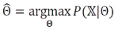

# [Week8 - Day4] Deep Learning 5

## 1. 확률과 통계
  - 머신러닝이 처리할 데이터는 불확실한 세상에서 발생
  - 불확실성을 다루는 확률과 통계를 잘 활용해야 함
  - *P*(*X*) -> *Y* : *P*(*y*|*x*)

### 1-1 확률 기초
  - 확률 변수
    - 다섯 가지 경우 중 한 값을 갖는 확률변수 *x*
      - ex) 윷 던지기 *x*의 정의역 {도, 개, 걸, 윷, 모}
  - 확률분포
    - 이산확률변수, 연속확률변수
      - 
  - 확률벡터
    - 확률변수를 요소로 가짐
  - 간단한 확률실험 장치
    - 주머니에서 번호를 뽑은 다음, 번호에 따라 해당 병에서 공을 뽑아서 색을 관찰
    - 번호를 *y*, 공의 색을 *x*라는 확률변수로 표현하면 정의역은 *y* \in {1, 2, 3}, *x* \in {blue, white}
  - 곱 규칙(Product) 과 합 규칙(Sum)
    - 조건부 확률에 의한 결합확률 계산 
      -*P*(*y*, *x*) = *P*(*x*|*y*)*P*(*y*)
    - 합 규칙과 곱 규칙에 의한 주변확률 계산
      - 
  - 기타 규칙
    - 

### 1-2 베이즈 정리와 머신 러닝
  - 베이즈 정리
    - P(y|x) = P(x|y)P(y) / P(x)
    - ex) 공을 뽑아서 하얀 공인 경우, 어느 병에서 나왔는 추정하라
    - 해석
      - posterior(사후확률) = likelihood(우도) * prior(사전확률)
    - 기계 학습에 적용
      - 사후확률 P(y|**x**)를 직접 추정하는 일은 아주 단순한 경우를 빼고 불가능
      - 따라서 베이즈 정리를 이용하여 추정
        - 사전확률은 P(y = ci) = ni / n
        - 우도확률은 밀도 추정 기법으로 추정

### 1-3 최대 우도
  - 파라미터 \theta를 모르는 상황에서 파라미터를 추정하는 문제
  - 최대 우도
    - 어떤 확률변수의 관찰된 값들을 토대로 그 확률변수의 파라미터를 계산
    - 
    - 일반화
      - 
    - 수치적 안정을 위해 로그 사용
      - 최대 로그우도 추정 
        - 
      - 단조 증가하는 로그 함수를 이용하여 계산 단순화

### 1-4 평균과 분산
  - 데이터의 요약 정보로서 평균과 분산
    - 평균 : \mu = *E*(*f*(*x*))
    - 분산 : \sigma2 = *V*(*f*(*x*)) = *E*(*f*2(*x*)) - *E*(*f*(*x*))2
  - 평균 벡터와 공분산 행렬 (확률변수의 상관정도)
    - \mu = *E*(**x**)
    - 
    -  
  
### 1-5 유용한 확률분포
  - 가우시안 분포
    - 평균 \mu와 분산 \Sigma2를 따르는 정규분포
    - 다차원 가우시안 분포
      - 평균벡터 **u**와 공분산행렬 **\Sigma**로 정의
  - 베르누이 분포
    - 성공(x=1) 확률 *p*, 실패(x=0)확률 1-*p*인 분포
    - Ber(x;p) = *p**x*(1-*p*)1-*x*
  - 이항 분포
    - 성공확률이 *p*인 베르누이 실험을 *m*번 수행할 때 성공할 횟수의 확률분포
    - *B*(*x*; *m*, *p*) = *C**m**x**p**x*(1-*p*)*m*-*x* = (*m*! / *x*!(*m*-*x*)!) * *p**x*(1-*p*)*m*-*x* 
  - 확률분포와 연관된 유용한 함수들
    - 로지스틱 시그모이드(Logistic Sigmoid)
      - 일반적으로 베르누이 분포의 파라미터 조정을 통해 얻어짐
    - 소프트플러스(Softplus)
      - 정규분포의 파라미터 조정을 통해 얻어짐
    - 기타
      - 
      - 혼합 분포 : 확률 분포 여러개를 혼합하여 설명할 때 사용
  - 변수 변환
    - 기존 확률변수를 새로운 확률변수로 변환
    - 변환 *y* = *g*(*x*)와 가역성을 가진 *g*에 의해 정의되는 두 확률변수 *x*, *y* 를 가정
      - 두 확률변수는 상호정의 가능
        - 
    - 데이터 생성시 주어진 분포에 변화가 필요한 경우에 사용

### 1-6 정리
  - 해결하려는 확률분포는 Target Distribution과 관련
    -  Target distribution을 확률적으로 표현 가능
    - 확률적인 모델을 통해 문제 해결법을 탐색 가능
  - 베이즈 정리
    - 사후확률 = 우도 * 사전 확률
    - 최대 우도 함수
      - 머신 러닝 관점에서 데이터의 관계를 설명할 수 있는 요소
      