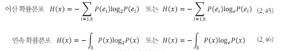
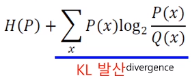
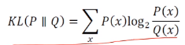
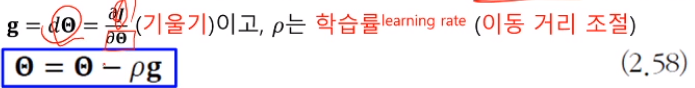

# [Week8 - Day4] Deep Learning 6

## 1. 정보이론
  - 정보이론과 확률통계는 많은 교차점
  - 확률통계는 기계학습의 기초적인 근간 제공
    - 해당 확률 분포 추정
    - 확률 분포 간의 유사성 정량화
  - 정보이론 관점에서도 머신러닝에 접근 가능
    - 불확실성을 정량화하여 정보이론 방법을 활용
      - 엔트로피, 교차 엔트로피, KL 발산
  - 정보이론 사건이 지닌 정보를 정량화 할 수 있는가
    - 기본원리 : 확률이 작을수록 많은 정보
      - 자주 발생하는 사건보다 잘 일어나지 않는 사건이 정보량이 많음
  - 자기 정보
    - 사건 *e*의 정보량
      - 로그의 밑이 2 -> 비트(bit), e -> 나츠(nat)
  - 엔트로피
    - 확률변수 *x*의 불확실성을 표현
    - 모든 사건 정보량의 기대값으로 표현
    - 
    - 동전의 발생 확률에 따른 엔트로피 변화
      - 공평한 동전 -> 가장 큰 엔트로피
      - 동전 던지기 결과 전송에는 최대 1비트가 필요
    - 모든 사건이 동일한 확률을 가질 때 = 불확실성이 가장 높을 때
      - 엔트로피가 최고치
      - ex) 주사위와 윷
  - 교차 엔트로피
    - 두 확률분포 사이의 교차 엔트로피
      - 딥러닝의 손실함수로 주로 사용
      - 
        - P를 데이터 분포라 가정 -> 학습 과정에서 변화 X
        - 따라서, 교차 엔트로피를 손실함수로 사용하면 KL 발산의 최소화와 동일
  - KL Divergence (KL 발산)
    - 
    - 두 확률분포 사이의 거리 계산에 주로 사용
    - 교차 엔트로피와의 관계
      - H(P, Q) = P의 엔트로피 + P,Q 사이의 KL 발산
      - 가지고 있는 데이터 분포 P(X)와 추정힌 데이터 분포 Q(x)간의 차이를 최소화하는데 사용

## 2. 최적회
  - 순수 수학 최적화와 머신러닝 최적화의 차이
    - 순수 수학
      - 함수의 최저값, 최고값 계산 등
    - 머신 러닝
      - Train Set이 주어지고 목적함수의 최저값을 만드는 모델의 파라미터 탐색
      - 확률적 경사하강법 등
        - 손실함수의 미분 필요 -> 역전파 알고리즘

### 2-1 파라미터 공간의 탐색
  - 학습 모델의 파라미터 공간
    - 특징 공간의 높은 차원 대비 Train Set의 크기가 작아 참인 확률 분포 계산 불가능
    - 따라서 머신러닝은 적절한 모델을 선택하여 목적함수를 정의, 파라미터 공간 탐색을 통해 목적함수 값이 최저가 되는 최적의 지점을 찾는 전략 사용
      - 특징 공간에서 이뤄져야 하는 일을 모델 파라미터 공간으로 대치
    - 특징 공간 대비 수 배 ~ 수만 배의 많은 차원이 존재
      - EX) MNIST : 특징공간 -> 784차원, 파라미터 공간 -> 수십만~수백만 차원
    - 머신러닝이 해야 할 일
      - 손실함수 *J*(\theta)를 최소로 하는 최적해 \hat(\theta)의 탐색
      - \hat(\theta) = argmin(*J*(\theta))
  - 최적화 문제 해결
    - Exhaustive Search (완전 탐색)
      - 차원이 조금만 높아져도 적용 불가능
    - Random Search
      - 전략 X, 임의 값을 통한 탐색
    - Gradient Descent (경사 하강법)
      - 미분을 통해 목적함수가 작아지는 방향으로 탐색

### 2-2 미분
  - 미분에 의한 최적화
    - 1차 도함수 *f*'(*x*) -> 함수의 기울기(경사)를 제공 -> 값이 커지는 방향을 지시
      -*f*'(*x*) 방향에 목적함수의 최저점이 존재
  - 편미분
    - 변수가 복수인 함수의 미분
    - 경사도(Gradient) : 미분 값이 이루는 벡터
    - 머신러닝에서의 편미분
      - 파라미터 집합 \theta는 복수 파라미터 -> 편미분 필요
  - 독립변수와 종속변수의 구분
    - 독립변수 : 독립적으로 존재하는 변수
    - 종속변수 : 독립변수에 의해 정의되는 변수
    - 머신러닝에서 예측 단계를 위한 해석 -> 의미 X
  - 최적화는 학습에 필요, 예측에 필요 X
    - 손실함수 값 error = *J*(\theta)
      - error -> 종속변수
  - 연쇄법칙
    - 합성함수의 미분에 필요
    - 다층 퍼셉트론 -> 합성함수
      - 오류 역전파의 과정에서 합성함수 미분 적용
  - 야코비안 행렬 (Jacobian)
    - 함수 **f** : **R***d* -> **R***m* 를 미분하여 얻은 행렬
    - 표기 : **J**
  - 헤세 행렬 (Hessian)
    - 2차 편도함수
    - 표기 **H**

### 2-3 경사 하강법 (Gradient Descent)
  - 
  - 함수의 기울기를 계산하여 기울기가 낮은 쪽으로 반복적으로 이동하여 최소값에 도달
  - Batch Gradient Descent (BGD, 집단 경사 하강법)
    - 샘플의 경사도를 계산하여 평균을 낸 후 한 번에 갱신
    - 반복마다 Train Set 전체를 확인 -> 시간이 오래 걸림
  - Stochastic Gradient Descent (SGD, 확률적 경사 하강법)
    - 한 샘플(or mini-batch)의 경사도를 계산하여 즉시 갱신
  - 비교
    - BGD : 속도 ↓, 정확한 방향으로 수렴
    - SGD : 속도 ↑, 수렴까지 방향이 정확하지 않을 수 있음
  - 추가 알고리즘 (SGD + 추가 제어 알고리즘)