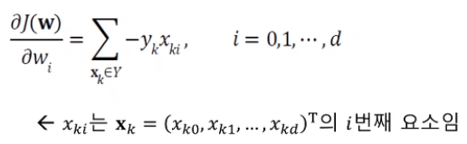
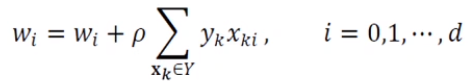

# [Week9 - Day1] Deep Learning 8 - Multi-Layer Perceptron

## 1. 미리보기
  - 인공신경망
    - 기계학습 역사에서 가장 오래된 머신 러닝 모델
      - 퍼셉트론 -> 다층 퍼셉트론 -> Deep Neural Network
    - 다양한 형태의 인공신경망 -> 높은 성과

## 2. 신경망 기초
### 2-1 인공신경망과 생물신경망
  - 생물의 뉴런
    - 두뇌의 가장 작은 정보처리 단위
    - 구조
      - 세포체 - 간단한 연산
      - 수상돌기 - 신호 수신
      - 축삭 - 처리 결과 전송
  - 컴퓨터 과학 + 뇌 과학 시너지
    - 컴퓨터 과학
      - 컴퓨터의 연산 능력의 획기적 발전
    - 뇌 과학
      - 뇌의 정보처리 방식 규명 연구
    - 컴퓨터가 사람 뇌의 정보처리를 모방하여 지능적 행위를 할 수 있는 인공지능의 도전
      - 뉴런의 동작 이해를 모방한 초기 인공 신경망 연구 시작 -> 퍼셉트론

### 2-2 종류
  - 다양한 모델
    - 전방 신경망 <-> 순환 신경망
    - 얕은 신경망 <-> 깊은 신경망
  - 결정론적 신경망 <-> 확률론적 신경망
    - 결정론적 - 모델의 파라미터와 조건에 의해 출력이 완전히 결정되는 신경망
    - 확률론적 - 고유의 임의성을 가지고 파라미터와 조건이 같아도 다른 출력이 될 수 있는 신경망

### 2-3 퍼셉트론
  - 절, 가중치, 층과 같은 새로운 개념의 구조 도입
  - 제시된 퍼셉트론 구조의 학습 알고리즘 제안
  - 원시적 신경망이지만, DNN을 포함하는 현대 인공신경망의 토대
    - DNN : 퍼셉트론의 병렬배치를 순차적 구조로 결합
  - 현대 인공신경망의 중요한 구성 요소

#### 2-3-1 구조
  - 입력
    - *i* 번째 노드는 특징 벡터 **x**의 요소 *x**i*를 담당
    - 항상 1이 입력되는 편향 노드 포함
  - 입력과 출력 사이에 연산하는 구조
    - *i*번째 입력 노드와 출력 노드를 연결하는 변은 가중치 *wi*를 가짐
    - 퍼셉트론은 단일 층 구조로 간주
  - 출력
    - 한 개의 노드에 의한 수치 (1, -1) 출력

#### 2-3-2 동작
  - 선형 연산 -> 비선형 연산
    - 선형 : 입력값과 가중치를 곱하고 모두 더해서 계산
    - 비선형 : 활성함수 \tau를 적용
      - 활성함수 \tau로 계단 함수 사용 -> 출력 y = 1 또는 -1
    - 수식
      - y = \tau(s)
  - 행렬 표기
    - *s* = **w**T**x** + *w*0
    - 편향 항을 벡터에 추가
      - *s* = **w**T**x**
    - 퍼셉트론의 동작을 식으로 표현
      - *y* = \tau(**w**T**x**)
  - 결정 경계
    - 결정 직선 : *d*(**x**) = *d*(*x*1, *x*2) = *w*1*x*1 + *w*2*x*2 + *w*0
      - *w*1, *w*2 는 직선의 기울기, *w*0은 절편(편향) 결정
      - 결정 경계는 특징 공간을 1, -1 두 공간으로 분할하는 분류기 역할
    - *d* 차원 공간으로 일반화
      - 2차원 : 결정 직선, 3차원 : 결정 평면, 4차원 이상 : 결정 초평면

#### 2-3-3 학습
  - 동작 -> 학습이 끝난 퍼셉트론의 동작
  - 가중치가 어떤 값을 가져야 100% 정확하게 분류할까?
    - 현실은 *d* 차원 공간 수백-수만개의 샘플
  - 일반적인 분류기의 학습 과정   
    - ① 과업 정의, 분류 과정의 수학적 정의 (가설 설정)
    - ② 해당 분류기의 목적함수 *J*(\theta) 정의
    - ③  *J*(\theta)를 최소화하는 \theta를 찾기 위한 최적화 방법 수행
  - 목적함수 정의
    - 퍼셉트론의 파라미터를 **w** = (*w*0, *w*1, ..., *w**d*)T
      - 파라미터 집합 \theta = {**w**}로 표기
      - 목적함수 *J*(\theta) or *J*(**w**)로 표기
      - 퍼셉트론 목적함수의 상세 조건
        - *J*(**w**) >= 0
        - **w**가 최적 -> 모든 샘플을 맞히면 *J*(**w**) = 0
        - 틀리는 샘플이 많은 **w**일수록 *J*(**w**) 값 ↑
    - 목적함수 상세 설계
      - *J*(**w**) = \Sigma(-*y**k*(**w**T**x***k*)), *Y*는 틀리는 샘플의 집합
        - 임의의 샘플 **x**k가 *Y*에 속한다면 퍼셉트론의 예측값과 실제값은 부호가 다름 -> -*y**k*(**w**T**x***k*) 는 항상 양수
        - *Y*가 공집합일 때, *J*(**w**) = 0
        - *Y*가 클수록 *J*(**w**)가 커짐
  - 경사 하강법 (Gradient Descent)
    - 최소 *J*(\theta) 기울기를 이용하여 극값을 반복 탐색
    - 경사도 계산
      - 일반화된 가중치 갱신 규칙 \theta = \theta - \law * **g**
        - 적용을 위해 경사도 **g** 필요
        -  *J*(**w**) = \Sigma(-*y**k*(**w**T**x***k*)) 를 편미분 후 정리
          - 
      - 델타 규칙 - 일반화된 가중치 갱신규칙에 위의 수식을 대입
        - 
        - 퍼셉트론의 학습 방법
  - 퍼셉트론 학습 알고리즘
    - 확률론적 (Stochastic)
      - 샘플 순서를 섞어서, 틀린 샘플이 발생하면 즉시 갱신
    - batch
      - Train Set의 샘플을 모두 맞출때까지 학습을 반복
      - 선형 분리가 불가능한 경우 -> 무한 반복
        - 종료 조건을 개선이 없는 경우로 수정 필요