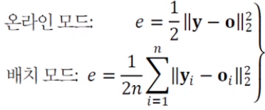
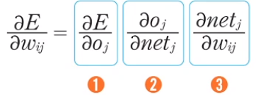
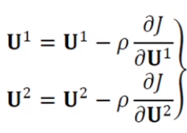
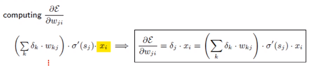

# [Week9 - Day2] Deep Learning 10 - MLP 2

## 1. 오류 역전파 알고리즘
  - 순방향 전파
    - 입력 -> 은닉 -> 출력
  - 역방향 전파
    - 출력 -> 출력 오차 -> 은닉

### 1-1 목적함수의 정의
  - Train Set (훈련집합)
    - 특징벡터 집합 **X**와 부류벡터 집합 **Y**
    - 부류벡터는 단발성(One-Hot) 코드로 표현
  - 머신러닝의 목표
    - 모든 샘플을 옳게 분류하는 함수 **f**의 탐색
  - 목적함수(손실함수)
    - 평균제곱오차(MSE)로 정의
      - 

### 1-2 설계
  - 연산 그래프 (Computational Graph)
    - 전방 연산을 그래프로 표현
  - 연쇄 법칙의 구현
    - 반복되는 부분식들을 저장, 재연산의 최소화
    - 값이 변하는 방향이 필요 -> 미분
    - 신경망 역시 특정 위치의 미분을 위해서 반복되는 부분의 재활용
  - 연쇄법칙
    - 미분의 조합을 통해 손실함수의 계산값을 원하는 노드까지 전달 가능
    - 
      - ① 출력값에 따른 오차의 변화량
      - ② 활성함수에 따른 출력값의 변화량
      - ③ 가중치에 따른 활성함수의 변화량
  - *J*(\theta) = 1/2 * || **y** - **o**(\theta)||22
    - *J*(\theta) = *J*({**U**1, **U**2})의 최저점을 찾는 경사 하강법
      - 
  - 오류 역전파 알고리즘
    - 출력의 오류를 역방향으로 전파하며 경사도를 계산하는 알고리즘
    - 반복되는 부분식들의 경사도의 지수적 폭발 혹인 소실 문제 해결 필요
  - 역전파 분해
    - 원하는 가중치에 대한 에러의 미분
    - Downstream Gradient <- Upstream Gradient + local Gradient
  - 실제 역전파
    - 

### 1-3 오류 역전파를 이용한 학습 알고리즘
  - 도함수의 종류
    - 스칼라 -> 스칼라
    - 벡터 -> 스칼라 : 기울기
    - 벡터 -> 벡터 : 야코비언
  - 오류 역전파 -> 미분의 연쇄 법칙 이용

## 2. Mini-batch Stochastic Gradient Descent
  - 미니 배치
    - 한번에 *t*개의 샘플을 처리
      - t = 1 이면 Stochastic
      = t = n 이면 Batch
    - 일반적으로 t = 수십 ~ 수백
      - 경사도의 잡음 감소
      - GPU 병렬처리에 유리