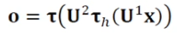

# [Week9 - Day2] Deep Learning 9 - MLP

## 1. 다층 퍼셉트론
  - 퍼셉트론 - 선형 분류기 한계
    - XOR 문제
  - 핵심 아이디어
    - 은닉층 : 원래 특징 공간을 분류하는 데 유리한 새로운 특징 공간으로 변환
    - 시그모이드 : 계단 함수 대신 연성 의사결정이 가능한 시그모이드 사용
    - 역전파 : 역방향으로 진행하면서 한번에 한층씩 그래디언트를 계산, 가중치를 갱신

### 1-1 특징 공간 변환
  - 퍼셉트론 2개를 병렬 결합
    - 원래 공간 **x**를 새로운 특징 공간 **z**로 변환
    - 새로운 공간에서 선형분리 가능
  - 추가 퍼셉트론 1개를 순차 결합
    - 새로운 특징 공간 **z**를 선형분리하는 퍼셉트론
  - 용량
    - *p*개 퍼셉트론 결합 -> *p*차원 공간

### 1-2 활성함수
  - 계단함수 -> 경성 의사결정 -> 영역을 점으로 변환
  - 그 외 -> 연성 의사결정 -> 영역을 영역으로 변환
  - 대표적인 비선형 함수인 시그모이드를 활성함수로 사용
  - 다양한 활성함수
    - 계단 (Step)
    - 시그모이드 (logistic Sigmoid)
    - 하이퍼볼릭 탄젠트 (tanh)
    - Softmax
    - ReLU(Rectifier)
  - 일반적으로 은닉층에서는 시그모이드 사용
    - S자 모양의 넓은 포화곡선 -> 경사도 기반의 학습을 어렵게 함
    - DNN에서는 ReLU 사용
      - Gradient Vanishing

### 1-3 구조
  - d+1개의 입력 노드, c개의 출력 노드
  - p개의 은닉 노드 -> p가 하이퍼파라미터
    - p가 너무 크면 과잉 적합, 작으면 과소 적합
  - MLP의 가중치
    - *ulij* : l-1번째 은닉층의 i번째 노드를 l번째 은닉층의 j번째 노드와 연결하는 가중치

### 1-4 동작
  - 특징 벡터 **x**를 출력 벡터 **o**로 매핑하는 함수로 간주 가능
    - 2층 : **o** = **f**2(**f**1(**x**))
  - 다층 퍼셉트론의 동작
    - 
  - 은닉층 (Hidden Layer)
    - 특징 추출기 역할
    - 특징 벡터를 분류에 더 유리한 새로운 특징 공간으로 변환

### 1-5 기본 구조
  - 범용적 근사 이론
    - 하나의 은닉층 -> 함수의 근사
    - 다층 퍼셉트론 -> 공간 변환의 근사 함수
  - 얕은 은닉층 구조
    - 넓은 폭이 필요할 수 있음
    - 과잉적합되기 쉬움
    - 깊은 은닉층의 구조가 좋은 성능을 가짐
  - 은닉층의 깊이에 따른 이점
    - 입력 공간을 어디서 나눌지를 지정 -> 지수적으로 많은 선형적 영역의 조각

### 1-6 MLP에 의한 인식
  - 예측
    - 학습을 마친 후에 현장에 설치하여 사용
  - 시각화
    - 텐서보드
    - playground.tensorflow.org

### 1-7 특성
  - 역전파 알고리즘 속도 ↑
  - 모든 함수를 정확하게 근사 가능
  - 성능 향상을 위한 경험의 중요성
    - 순수 최적화 알고리즘 -> 높은 성능 불가능
      - 데이터의 희소성, 잡음 등
    - 경험적 개발
      - 아키텍처 - 은닉층, 은닉 노드 개수
      - 초기값 - 가중치
      - 학습률
      - 활성함수의 결정