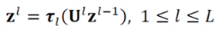

# [week9 - Day3] Deep Learning 11

## 1. 미리보기
  - 심층학습
    - 다층 퍼셉트론 + 여러개의 은닉층 -> 깊은 신경망 (DNN)
    - 깊은 신경망의 학습
    - 새로운 응용을 창출하고 인공지능의 성능을 획기적으로 향상

## 2. 딥러닝의 등장
  - 배경
    - 1980년대 아이디어 등장
    - 그러나 기술 부족으로 실현 불가능
      - Vanishing Gradient
      - 부족한 데이터
      - 과다한 연산 -> 많은 시간 필요
    - 지속적인 연구
      - 학습률, 모멘텀, 은닉노드, 데이터 전처리, 활성함수, 규제 등
    - Vanishing Gradient
      - 활성함수의 변화를 통해 해결

### 2-1 성공 배경
  - 혁신적인 알고리즘의 등장
    - 합성곱 신경망(Convolution Neural Network, CNN)
      - 부분 연결과 가중치 공유를 통해서 효율적인 신경망 학습 구조 제공
    - ReLU 활성함수
    - 과잉적합 방지를 위한 다양한 규제 기법
    - 층별 예비학습 기법
  - 비용이 낮은 GPGPU의 등장
  - 학습 데이터 양과 질의 향상

### 2-2 표현 학습의 부각
  - 머신러닝의 새로운 전환
    - 전통적인 다층 퍼셉트론
      - 은닉층 -> 특징의 추출
        - 얕은 구조로 인해 가공되지 않은 오리지널 패턴을 입력시 낮은 성능
      - 데이터에서 수작업을 통해 추출한 특징을 신경망에 입력 -> 신경망에서 분류
    - 현대 머신러닝
      - 학습에 의해 자동적으로 데이터에서 특징을 추출 (표현 학습)
        - 특징 벡터를 신경망에 입력 (종단간 학습)
        - 특징 학습 + 분류
  - DNN의 표현학습
    - 낮은 단계 은닉층 -> 선, 모서리 같은 간단한 특징
    - 높은 단계 은닉층 -> 추상적인 향태의 복잡합 특징
    - 기존 응용에서 획기적인 성능 향상
      - 영상인식, 음성인식, 언어 번역
      - 새로운 응용 창출
        - 생성 모델, 영상 분할 등

## 3. DMLP
### 3-1 구조와 동작
  - 구조
    - 입력과 출력
    - *L*-1개의 은닉층
  - 가중치 행렬
  - 동작
    - MLP의 동작을 나타내는 식을 보다 많은 단계로 확장
    - 전방 계산
      - 입력층의 특징벡터 **z**, 가중치 행렬 **U**
      - 

###-3-2 학습
  - DMLP 학습 = MLP 학습과 유사
    - DMLP는 경사도 계싼과 가중치 갱신을 더 많은 단계에 걸쳐서 수행
    - 오류 역전파 알고리즘
  - 역사적 고찰
    - 주요 알고리즘의 개선
      - 모델 : 퍼셉트론 -> 다층 퍼셉트론 -> DMLP
      - 활성함수 : 계단함수 -> 시그모이드 -> ReLU
      - 목적함수 : MSE -> MSE -> 교차 엔트로피, 로그우도
    - 컨볼루션 신경망의 등장

## 4. 딥러닝이 강력한 이유
  - 종단간 최적화된 학습 가능
    - 깊은 신경망 전체를 동시에 최적화
  - 깊이의 중요성
    - 은닉층이 늘어남에 따라 표현력이 증가(정교한 근사)
  - 계층적 특징
    - 깊은 신경망 -> 층별 역할이 구분됨
    - 얕은 신경망 -> 하나 혹은 두 개의 은닉층이 여러형태의 특징을 모두 담당
  - 최신 딥러닝
    - 이미지 분류
    - Super Resolution
    - QuAD
    - 게임 등등